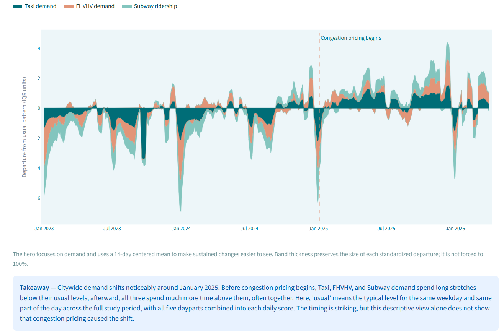
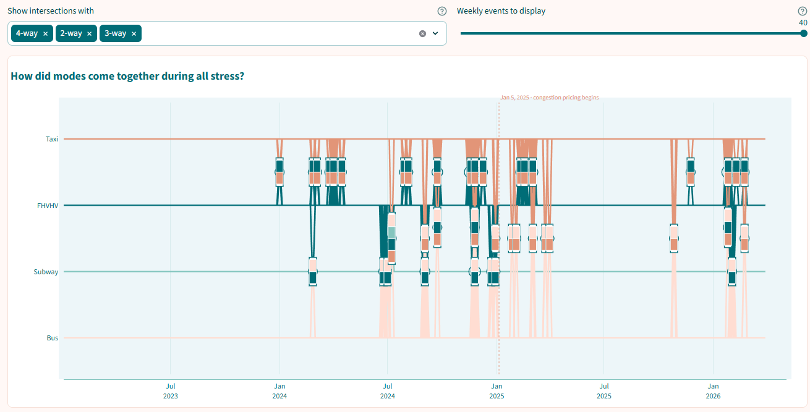
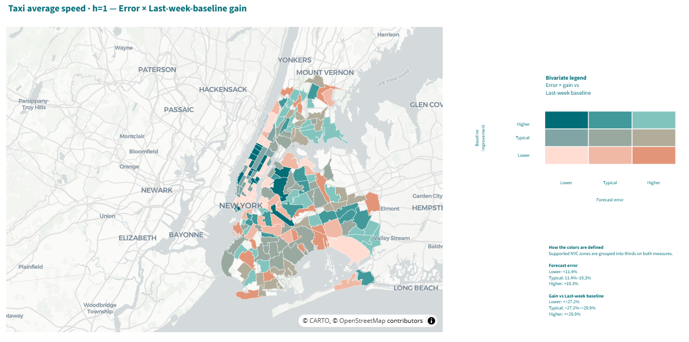
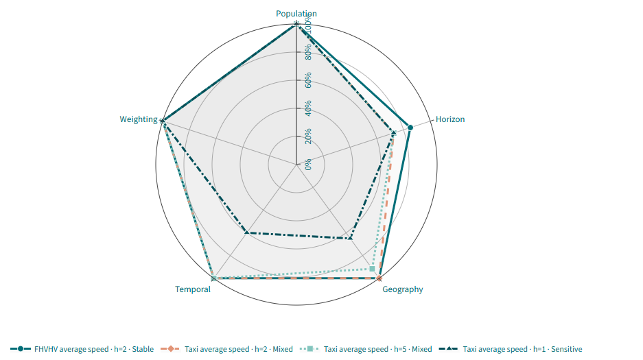
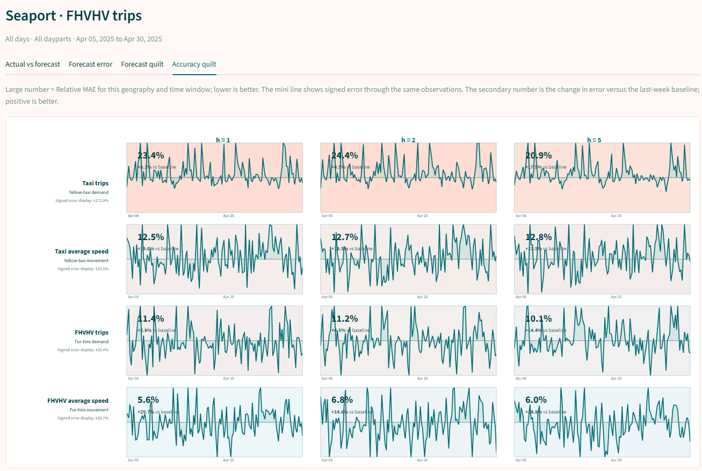
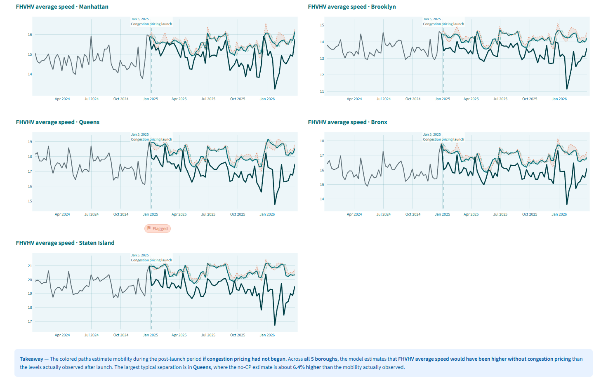

# NYC Congestion Pricing Mobility Showcase

**An interactive exploration of how New York City mobility changed around congestion pricing — across time, geography, transportation modes, forecasting, and a modeled no-congestion-pricing alternative.**

[**Explore the Live Mobility Showcase ↗**](https://nyc-mobility-showcase-148034634843.us-east1.run.app/)  
[View the analytical pipeline ↗](https://github.com/jesingson/NYC-Congestion-Pricing-Mobility-v2)

[](https://nyc-mobility-showcase-148034634843.us-east1.run.app/)

---

## What is this?

The **NYC Congestion Pricing Mobility Showcase** is the interactive presentation layer for the NYC Congestion Pricing Mobility v2 project, developed for **SIADS 696: Milestone II** in the University of Michigan Master of Applied Data Science program.

The underlying analysis follows NYC mobility from **January 2023 through March 2026**, spanning the **January 5, 2025** congestion-pricing launch. It brings Taxi, FHVHV, Subway, Bus, weather, and NYC geography into a common analytical framework built around **263 Taxi Zones**.

Rather than reproduce the notebook pipeline, this repository turns selected final outputs into an explorable Streamlit application. The Showcase moves from what actually happened, to when mobility became unusual, to how well future mobility can be forecast, and finally to a model-estimated alternative in which congestion pricing had not begun.

| | |
|---|---|
| **Study period** | January 2023 – March 2026 |
| **Congestion pricing begins** | January 5, 2025 |
| **Geographic coverage** | 263 NYC Taxi Zones |
| **Core analytical grain** | Taxi Zone × Date × Temporal Bucket |
| **Unified mobility panel** | 1,559,590 observations |
| **Primary modes** | Taxi, FHVHV, Subway, Bus |
| **Additional context** | Weather, geography, CBD and gateway relationships |
| **Application** | Multi-page Streamlit Showcase |

---

## Four Questions to Start With

The Showcase is intentionally non-linear. The homepage offers four entry points depending on what you want to understand.

| Question | Start here | Then explore |
|---|---|---|
| **What changed?** | Temporal Overview | Spatial Patterns |
| **When and where did mobility become unusual?** | Mobility Drivers | Stress Anomaly Patterns |
| **Can we predict what happens next?** | Forecast Scorecard | Forecast Reliability |
| **What might have happened without congestion pricing?** | Counterfactual Overview | Counterfactual Robustness |

[**Open the interactive Showcase ↗**](https://nyc-mobility-showcase-148034634843.us-east1.run.app/)

---

## Explore the Showcase

The application contains **27 analytical views** organized around six complementary ways of looking at NYC mobility.

| Area | What you can explore |
|---|---|
| **Mobility Patterns** | Temporal change, time-of-day patterns, spatial change, Taxi Zone rankings, and individual Zone Profiles |
| **Relationships & Dynamics** | How modes move together or apart, rolling relationships, weather relationships, animated Mobility Pulse views, and cyclical time |
| **Mobility Types & Drivers** | Recurring mobility environments, Mobility Day Types, and the modes driving changes in citywide mobility |
| **Stress & Anomalies** | When unusual mobility conditions occurred, where they concentrated, which modes were involved, and how weather relates to stress episodes |
| **Forecasting & Reliability** | Forecast accuracy, geographic reliability, and where the selected forecasting system wins or misses relative to a simple Last-week baseline |
| **Counterfactual Mobility** | Observed mobility versus an estimated alternative without congestion pricing, including geographic and multimodal differences, robustness checks, and gap calibration |

### How did citywide mobility move across modes and time?



The Showcase begins with the observed mobility record itself. Citywide views make it possible to compare how Taxi, FHVHV, Subway, and Bus activity evolved through the study period before moving into more detailed temporal, spatial, and mode-specific views.

### When did NYC's modes become unusual together?



The stress views connect unusual conditions across Taxi, FHVHV, Subway, and Bus instead of treating each mode as an isolated system. The application can move from citywide timing to spatial patterns and individual stress episodes.

### Where does forecasting work — and where is mobility simply harder to predict?



Forecast error and improvement over a simple Last-week baseline answer different questions. The reliability views expose both, making it possible to distinguish places that are relatively predictable from places where forecasting still adds value despite difficult conditions.

### How sensitive is the estimated alternative without congestion pricing to analytical choices?



Counterfactual robustness is deliberately shown as a profile rather than a single confidence-like score. The application compares how conclusions behave across alternative population, weighting, temporal, geographic, horizon, and calibration choices.

---

## From the Whole City to a Single Taxi Zone

The Showcase is not limited to citywide averages. Many views can be explored at Taxi-Zone level, making it possible to ask how the same place looks through different analytical lenses.



The Accuracy Quilt, for example, compares forecast performance inside a single Taxi Zone across mobility measures and forecast horizons. Other views let you profile a zone, compare it with other places, inspect stress geography, evaluate forecast reliability, and examine its estimated trajectory without congestion pricing.

---

## From Observation to Counterfactual

The Showcase follows a deliberate analytical progression:

```text
OBSERVE
What actually happened?
        │
        ▼
UNDERSTAND
How did modes, places, and unusual conditions relate?
        │
        ▼
PREDICT
What mobility should we expect next?
        │
        ▼
COMPARE WITH AN ALTERNATIVE
What might mobility have looked like without congestion pricing?
```

Forecasting is therefore not a separate side exercise. A forecasting system that has first been evaluated against mobility that actually occurred provides the foundation for the harder Chapter 5 question: estimating an unobserved no-congestion-pricing path.



---

## How This Repository Relates to Mobility v2

This repository and the analytical repository serve different jobs.

**[NYC Congestion Pricing Mobility v2 ↗](https://github.com/jesingson/NYC-Congestion-Pricing-Mobility-v2)** is the canonical analytical record. It contains the notebook-based pipeline that constructs the mobility foundation, develops mobility structure and anomaly detection, trains and evaluates forecasting models, and builds the counterfactual analysis.

**This Showcase repository** is the interactive presentation layer. It packages selected final analytical outputs, application-optimized tables, reusable data-access logic, visual assets, and Streamlit views so the results can be explored without rerunning the full research pipeline.

The application consumes final outputs from:

```text
1.3.1  Mobility foundation
3.1.1  Mobility profiles
3.2.2  Mobility environments
3.3.1  Temporal residual features
3.3.6  Stress anomaly outputs
3.4.2  Weather × stress handoff
4.7.1  Forecasting system
5.3.1  Counterfactual results
```

---

## Data Architecture

The `data/processed/` directory intentionally contains two kinds of application inputs.

**Upstream final tables** preserve the formal handoffs from the analytical pipeline. These are organized under versioned directories such as `1.3.1.final_tables/`, `3.3.6.final_tables/`, `4.7.1.final_tables/`, and `5.3.1.final_tables/`.

**`app_tables/`** contains application-oriented derivatives designed to make interactive exploration practical. These include spatial summaries, Mobility Day Types and Drivers, partitioned Zone Profile data, metric-specific stress histories, and pre-rendered Mobility Pulse animations.

This separation keeps the analytical contracts visible while allowing expensive transformations to happen before a visitor opens a page.

---

## Repository Structure

```text
NYC-Congestion-Pricing-Mobility-Showcase/
│
├── app/
│   ├── Home.py                 # Streamlit entry point and navigation
│   ├── views/                  # 27 analytical views + project context
│   ├── data_access/            # Reusable loading and aggregation logic
│   ├── components/             # Shared page components
│   ├── utils/                  # Shared project branding
│   └── images/                 # Curated homepage and README visuals
│
├── data/
│   └── processed/
│       ├── 1.3.1.final_tables/
│       ├── 3.1.1.final_tables/
│       ├── 3.2.2.final_tables/
│       ├── 3.3.1.final_tables/
│       ├── 3.3.6.final_tables/
│       ├── 3.4.2.final_tables/
│       ├── 4.7.1.final_tables/
│       ├── 5.3.1.final_tables/
│       ├── app_tables/
│       └── diagnostics/
│
├── scripts/                    # App-table builders, preaggregation, diagnostics
├── requirements.txt
├── Dockerfile
└── README.md
```

---

## Run Locally

Clone the repository:

```bash
git clone https://github.com/jesingson/NYC-Congestion-Pricing-Mobility-Showcase.git
cd NYC-Congestion-Pricing-Mobility-Showcase
```

Create and activate a virtual environment, then install the application dependencies:

```bash
python -m venv .venv
```

On Windows PowerShell:

```powershell
.\.venv\Scripts\Activate.ps1
pip install -r requirements.txt
```

Launch the Showcase from the repository root:

```bash
python -m streamlit run app/Home.py
```

Streamlit will print the local application address in the terminal.

---

## Interpretation Boundaries

The Showcase deliberately separates three different kinds of evidence.

**Pre/Post views are descriptive.** They show how observed mobility differs around the January 5, 2025 congestion-pricing launch. Timing and association alone do not establish that congestion pricing caused the entire observed change.

**Forecasting views evaluate prediction.** The forecasting system is tested against held-out observations it did not use for fitting. Performance varies across mobility measures, places, times, and forecast horizons.

**Counterfactual views are model-estimated.** The alternative trajectory without congestion pricing is produced by the forecasting and counterfactual system. The difference between observed mobility and that estimated path should not be read as a direct causal measurement.

Robustness labels such as **Stable**, **Mixed**, and **Sensitive** describe how consistently a result behaves across the analytical checks used in this project. They are not probabilities, significance tests, or guarantees of causal certainty.

---

## Project Lineage

This Showcase is part of **NYC Congestion Pricing Mobility v2**, developed from work for **SIADS 696: Milestone II** in the University of Michigan Master of Applied Data Science program.

The analytical pipeline is maintained separately so that the research record and the interactive presentation layer can evolve without conflating their roles.

[**Explore the Live Mobility Showcase ↗**](https://nyc-mobility-showcase-148034634843.us-east1.run.app/)  
[**View the Mobility v2 analytical repository ↗**](https://github.com/jesingson/NYC-Congestion-Pricing-Mobility-v2)

---

**Jaime Esingson**  
University of Michigan · Master of Applied Data Science
